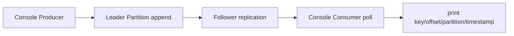

# Kafka 12장 (Producing and Consuming 이후) 팀 공유용 단일 문서

## 0) 세션 진행 방식
- 이 문서는 책의 순서대로 진행한다.
- 각 단원은 `무슨 개념인가 -> 내부적으로 어떻게 동작하나 -> 바로 확인 실습` 순서로 묶여 있다.
- 대상: 백엔드 개발자(배포 검증, 장애 분석, 운영 변경)

공통 변수:
```bash
export BS="localhost:9092,localhost:9093,localhost:9094"
export TOPIC="study.ch12.pc"
export GROUP="study-ch12-pc-group"
```

---

## 1) Producing and Consuming

### 1-1. 개념
- 콘솔 Producer/Consumer는 애플리케이션 코드 없이 Kafka 경로를 빠르게 검증하는 도구다.
- 실무에서는 배포 직후 smoke test, 장애 시 원인 분리에 가장 먼저 쓴다.
- 단, 상시 처리 파이프라인으로 쓰는 것은 권장되지 않는다.

### 1-2. 어떻게 동작하나
- `kafka-console-producer.sh`는 `org.apache.kafka.tools.ConsoleProducer`를 실행한다.
- `kafka-console-consumer.sh`는 `org.apache.kafka.tools.consumer.ConsoleConsumer`를 실행한다.
- 두 스크립트 모두 `kafka-run-class.sh`를 통해 JVM을 띄우고 `libs/*` classpath로 동작한다.



### 1-3. 바로 확인 실습
1. 토픽 생성
```bash
kafka-topics.sh --bootstrap-server "$BS" --create --topic "$TOPIC" --partitions 3 --replication-factor 3
```

2. producer로 key/value 메시지 전송
```bash
kafka-console-producer.sh \
  --bootstrap-server "$BS" \
  --topic "$TOPIC" \
  --property parse.key=true \
  --property key.separator=:
```
입력:
```text
order-1001:{"event":"created"}
order-1002:{"event":"paid"}
order-1001:{"event":"shipped"}
```

3. consumer로 메타정보 포함 출력
```bash
kafka-console-consumer.sh \
  --bootstrap-server "$BS" \
  --topic "$TOPIC" \
  --from-beginning \
  --max-messages 3 \
  --property print.key=true \
  --property print.partition=true \
  --property print.offset=true \
  --property print.timestamp=true
```

### 1-4. 콘솔 프로듀서 설정 옵션 (실무에서 자주 쓰는 것)

개념:
- 콘솔 프로듀서도 일반 producer 설정을 받아서 배치/압축/신뢰성 동작을 바꿀 수 있다.
- 전달 방식은 2가지다.
  - 파일: `--command-config <파일경로>` (`--producer.config`는 구옵션)
  - 인라인: `--command-property key=value` (`--producer-property`는 구옵션)

어떻게 동작하나:
- `ConsoleProducer`가 내부 KafkaProducer를 생성할 때 전달된 설정을 그대로 적용한다.
- 책에서 강조하는 대표 옵션: 배치(`batch.size`, `linger.ms`), 압축(`compression.type`), 동기 전송(`--sync`)
- line-reader 관련 옵션(`parse.key`, `key.separator`, `ignore.error`)으로 입력 파싱 방식을 제어한다.

바로 확인 실습:
1. 인라인 설정으로 전송
```bash
kafka-console-producer.sh \
  --bootstrap-server "$BS" \
  --topic "$TOPIC" \
  --sync \
  --command-property acks=all \
  --command-property compression.type=lz4 \
  --command-property linger.ms=20 \
  --command-property batch.size=32768 \
  --property parse.key=true \
  --property key.separator=:
```

2. 파일 설정으로 전송
```bash
cat > producer-console.properties <<'PROPS'
acks=all
compression.type=zstd
linger.ms=30
batch.size=65536
PROPS

kafka-console-producer.sh \
  --bootstrap-server "$BS" \
  --topic "$TOPIC" \
  --command-config producer-console.properties \
  --property parse.key=true \
  --property key.separator=:
```

### 1-5. `DefaultEncoder`와 `MessageReader`는 무엇인가

개념:
- `DefaultEncoder`
  - 책(구버전)에서 쓰던 표현으로, "입력 bytes를 그대로 보내는 기본 인코더" 의미다.
  - Kafka 4.2.0 콘솔 프로듀서에서는 `org.apache.kafka.common.serialization.ByteArraySerializer`가 기본값으로 설정된다.
- `MessageReader`
  - 콘솔 입력(stdin)을 읽어 `ProducerRecord`로 바꾸는 파서다.
  - 기본 구현은 `org.apache.kafka.tools.LineMessageReader`다.
  - `--line-reader`로 교체할 수 있고, `--reader-property`, `--reader-config`로 파싱 규칙을 조정한다.

어떻게 동작하나:
- `ConsoleProducer`가 `RecordReader`(기본 `LineMessageReader`)를 통해 입력을 파싱하고,
  생성된 레코드를 `KafkaProducer<byte[], byte[]>`로 전송한다.
- 즉, `MessageReader`는 입력 파싱 계층이고, `DefaultEncoder` 계열 개념(현재는 serializer)은 직렬화 계층이다.

예시 A. 기본 `LineMessageReader` 파싱:
```bash
kafka-console-producer.sh \
  --bootstrap-server "$BS" \
  --topic "$TOPIC" \
  --reader-property parse.key=true \
  --reader-property key.separator=:
```

예시 B. 커스텀 `MessageReader` 교체:
```bash
kafka-console-producer.sh \
  --bootstrap-server "$BS" \
  --topic "$TOPIC" \
  --line-reader "com.example.kafka.CustomJsonMessageReader" \
  --reader-property topic="$TOPIC"
```
`CustomJsonMessageReader`는 `org.apache.kafka.tools.api.RecordReader` 구현체여야 하며,
해당 클래스를 담은 JAR이 classpath에 있어야 한다.

---

## 2) Consumer Groups와 `__consumer_offsets`

### 2-1. 개념
- "소비했다"와 "오프셋을 커밋했다"는 다르다.
- `LAG = LOG-END-OFFSET - CURRENT-OFFSET`를 해석해야 장애 원인(처리 지연 vs 커밋 문제)을 구분할 수 있다.

### 2-2. 어떻게 동작하나
- `kafka-consumer-groups.sh`는 `org.apache.kafka.tools.consumer.group.ConsumerGroupCommand`를 실행한다.
- 오프셋 커밋은 내부 토픽 `__consumer_offsets`에 레코드로 저장된다.
- Kafka 4.2.0 기준 formatter는 `org.apache.kafka.tools.consumer.OffsetsMessageFormatter`를 사용한다.


### 2-3. 바로 확인 실습
1. 그룹 소비 실행
```bash
kafka-console-consumer.sh \
  --bootstrap-server "$BS" \
  --topic "$TOPIC" \
  --group "$GROUP" \
  --from-beginning \
  --max-messages 3
```

2. 그룹 상태 확인
```bash
kafka-consumer-groups.sh --bootstrap-server "$BS" --describe --group "$GROUP"
```

3. 내부 오프셋 토픽 확인
```bash
kafka-console-consumer.sh \
  --bootstrap-server "$BS" \
  --topic "__consumer_offsets" \
  --formatter "org.apache.kafka.tools.consumer.OffsetsMessageFormatter" \
  --from-beginning \
  --max-messages 20
```

추가 예시 (오프셋 토픽 직접 읽기):
```bash
# 오프셋 커밋 레코드 확인
kafka-console-consumer.sh \
  --bootstrap-server "$BS" \
  --topic "__consumer_offsets" \
  --formatter "org.apache.kafka.tools.consumer.OffsetsMessageFormatter" \
  --from-beginning \
  --max-messages 50

# 그룹 메타데이터 레코드 확인
kafka-console-consumer.sh \
  --bootstrap-server "$BS" \
  --topic "__consumer_offsets" \
  --formatter "org.apache.kafka.tools.consumer.GroupMetadataMessageFormatter" \
  --from-beginning \
  --max-messages 20
```

### 2-4. 컨슈머 설정 옵션 (간략)

개념:
- 콘솔 컨슈머도 일반 consumer 설정을 전달해 동작을 조정할 수 있다.
- 최신 옵션은 아래 2개다. (`--consumer.config`, `--consumer-property`는 구옵션)
  - 파일: `--command-config <파일경로>`
  - 인라인: `--command-property key=value`

바로 확인 실습:
```bash
cat > consumer-console.properties <<'PROPS'
auto.offset.reset=earliest
fetch.min.bytes=1
max.poll.records=100
PROPS

kafka-console-consumer.sh \
  --bootstrap-server "$BS" \
  --topic "$TOPIC" \
  --group "$GROUP" \
  --command-config consumer-console.properties \
  --command-property client.id=study-consumer-cli \
  --max-messages 5
```

### 2-5. 메시지 포매터 옵션 (간략)

개념:
- 콘솔 컨슈머 출력은 `MessageFormatter`가 만든다.
- 기본 formatter는 `org.apache.kafka.tools.consumer.DefaultMessageFormatter`.
- 출력 필드는 `--formatter-property`로 조정한다. (`--property`는 구옵션)

바로 확인 실습:
1. 기본 formatter + 출력 필드 지정
```bash
kafka-console-consumer.sh \
  --bootstrap-server "$BS" \
  --topic "$TOPIC" \
  --from-beginning \
  --max-messages 5 \
  --formatter "org.apache.kafka.tools.consumer.DefaultMessageFormatter" \
  --formatter-property print.key=true \
  --formatter-property print.partition=true \
  --formatter-property print.offset=true \
  --formatter-property print.timestamp=true
```

2. 로깅 formatter 사용
```bash
kafka-console-consumer.sh \
  --bootstrap-server "$BS" \
  --topic "$TOPIC" \
  --max-messages 5 \
  --formatter "org.apache.kafka.tools.consumer.LoggingMessageFormatter"
```

3. 출력 없이 소비(no-op formatter)
```bash
kafka-console-consumer.sh \
  --bootstrap-server "$BS" \
  --topic "$TOPIC" \
  --max-messages 5 \
  --formatter "org.apache.kafka.tools.consumer.NoOpMessageFormatter"
```

---

## 3) Partition Management - Preferred Leader Election

### 3-0. 파티션 관리의 두 가지 핵심 툴
- `kafka-leader-election.sh`
  - 유용한 상황: 브로커 재시작/장애 복구 후 리더가 한쪽으로 쏠려 트래픽 편중이 생겼을 때
  - 목적: 리더 분포를 빠르게 정리해서 broker 간 부하를 완화
- `kafka-reassign-partitions.sh`
  - 유용한 상황: 브로커 증설/축소, 파티션 replica 이동, replication factor 조정이 필요할 때
  - 목적: 파티션의 replica 배치를 계획적으로 변경해 용량/부하/가용성 요구사항을 맞춤

요약:
- 리더 "위치" 문제는 `leader-election`, replica "배치" 문제는 `reassign-partitions`로 접근한다.

### 3-1. 개념
- 리더 편중은 특정 broker의 CPU/네트워크/디스크 과부하로 이어진다.
- preferred leader election은 리더 분포를 더 바람직한 상태로 유도하는 작업이다.

### 3-2. 어떻게 동작하나
- `kafka-leader-election.sh`는 `org.apache.kafka.tools.LeaderElectionCommand`를 실행한다.
- 컨트롤러가 파티션별 리더를 재선출하고, 클라이언트는 메타데이터 갱신 후 새 리더로 붙는다.

### 3-2-1. `--election-type` 종류와 특징
- `preferred`
  - 의미: preferred replica(일반적으로 replica 리스트 첫 번째)를 리더로 선출 시도
  - 수행 조건: 현재 리더가 preferred가 아닐 때
  - 적합한 목적: 리더 편중 해소, 부하 균형 복구
  - 운영 리스크: 비교적 낮아 일상 운영에서 기본 선택
- `unclean`
  - 의미: 리더가 없는 파티션에서 ISR 밖 replica까지 포함해 리더 선출 시도
  - 수행 조건: 해당 파티션에 리더가 없을 때
  - 적합한 목적: 가용성 긴급 복구(서비스 재개)
  - 운영 리스크: 데이터 손실 가능성이 있어 매우 신중히 사용

### 3-2-2. 전체 선출 vs 일부 선출, 무엇이 더 좋은가
- `--all-topic-partitions`가 더 적합한 경우
  - 브로커 복구 후 클러스터 전반 리더 편중을 빠르게 정리해야 할 때
  - `preferred` 선출로 전체 균형을 한 번에 회복하고 싶을 때
- `--topic --partition`(또는 `--path-to-json-file`)가 더 적합한 경우
  - 특정 토픽/파티션만 문제일 때
  - 영향 범위를 최소화(blast radius 축소)하며 점진적으로 복구할 때
  - 결과를 보면서 단계적으로 적용하고 싶을 때

실무 권장:
1. 먼저 `preferred` + 일부 대상(`--topic --partition` 또는 `--path-to-json-file`)으로 검증
2. 필요 시 `preferred` + `--all-topic-partitions`로 확장
3. `unclean`은 리더 부재 복구가 급하고 데이터 손실 리스크를 수용할 때만 사용

### 3-3. automatic leader balancing이 꺼져 있을 때 (보강)
- 관련 설정:
  - `auto.leader.rebalance.enable=false` 이면 자동 리더 재분배가 수행되지 않는다.
  - (참고) 자동 점검 주기는 `leader.imbalance.check.interval.seconds`, 불균형 임계치는 `leader.imbalance.per.broker.percentage`로 제어한다.
- 이때 자주 생기는 현상:
  - 브로커 장애/재시작 중 리더가 살아있는 브로커로 이동
  - 장애 복구 후에도 리더가 원래 분포로 돌아오지 않고 편중 상태가 유지
  - 결과적으로 특정 broker에 Produce/Fetch 부하가 집중되고, 지연/처리량 편차가 커짐
- 언제 특히 문제인가:
  - 트래픽이 큰 토픽의 리더가 한 브로커에 몰릴 때
  - 클라이언트 쿼터/스로틀을 브로커 단위로 운영할 때
- 대응:
  - 복구 후 ISR 안정화 확인 -> `kafka-leader-election.sh --election-type preferred` 실행 -> 분포 재확인

상태 변화 그림 (auto leader balancing = OFF):
```text
[T0] 정상 상태 (리더 분포 균형)
Broker-1: P0(L)  P1(F)  P2(F)
Broker-2: P0(F)  P1(L)  P2(F)
Broker-3: P0(F)  P1(F)  P2(L)

[T1] Broker-1 장애/재시작 중 (리더 임시 이동)
Broker-1: P0(-)  P1(F)  P2(F)
Broker-2: P0(L)  P1(L)  P2(F)
Broker-3: P0(F)  P1(F)  P2(L)

[T2] Broker-1 복구 완료 + auto rebalance OFF
Broker-1: P0(F)  P1(F)  P2(F)
Broker-2: P0(L)  P1(L)  P2(F)   <-- 리더 편중 유지
Broker-3: P0(F)  P1(F)  P2(L)
결과: Broker-2에 Produce/Fetch 부하 집중, 지연 편차 발생

[T3] preferred leader election 수동 실행 후
Broker-1: P0(L)  P1(F)  P2(F)
Broker-2: P0(F)  P1(L)  P2(F)
Broker-3: P0(F)  P1(F)  P2(L)
결과: 리더 분포 균형 회복
```

수동 복구 상태 전이:
```text
복구 직후(T2) 편중 감지
-> kafka-topics --describe 로 Leader/ISR 확인
-> kafka-leader-election --election-type preferred 실행
-> describe 재확인
-> (여전히 불균형이면) 토픽/파티션 단위 선출 또는 재할당 검토
```

### 3-4. 바로 확인 실습
```bash
# 실행 전
kafka-topics.sh --bootstrap-server "$BS" --describe --topic "$TOPIC"

# 선호 리더 선출
kafka-leader-election.sh \
  --bootstrap-server "$BS" \
  --election-type preferred \
  --all-topic-partitions

# 실행 후
kafka-topics.sh --bootstrap-server "$BS" --describe --topic "$TOPIC"
```

일부 대상만 선출 예시:
```bash
kafka-leader-election.sh \
  --bootstrap-server "$BS" \
  --election-type preferred \
  --topic "$TOPIC" \
  --partition 0
```

---

## 4) Partition Management - Reassignment (Replica 변경)

### 4-1. 큰 그림: 재할당은 2가지 트랙이다
1. 파티션/레플리카 **배치 이동**  
- 같은 RF를 유지하면서 어떤 브로커에 배치할지를 바꾼다.
2. 토픽/파티션의 **RF(복제계수) 변경**  
- replica 개수 자체를 늘리거나 줄인다.

책에서 말하는 수동 변경 필요 상황은 이 2트랙으로 정리된다:
1. 자동 분산만으로 브로커 불균형이 해소되지 않음 -> 배치 이동
2. 브로커 오프라인으로 URP가 발생함 -> 배치 이동(또는 긴급 복구 후 재정렬)
3. 새 브로커 추가 후 빠른 분산 필요 -> 배치 이동
4. 기존 토픽 RF를 늘리거나 줄여야 함 -> RF 변경

### 4-2. 트랙 A - 파티션/레플리카 배치 이동
개념:
- 목적은 "어느 브로커에 둘지"를 바꾸는 것
- 주로 증설/편중 해소/장애 후 재정렬 때 사용

실행 절차:
1. `generate`로 이동 제안 생성
2. 제안 JSON 저장
3. `execute`로 반영
4. `verify`로 완료 확인

예시:
```bash
cat > topics.json <<JSON
{"version":1,"topics":[{"topic":"$TOPIC"}]}
JSON

kafka-reassign-partitions.sh \
  --bootstrap-server "$BS" \
  --topics-to-move-json-file topics.json \
  --broker-list "1,2,3" \
  --generate
```

출력 제안을 `reassign-move.json`으로 저장 후:
```bash
kafka-reassign-partitions.sh \
  --bootstrap-server "$BS" \
  --reassignment-json-file reassign-move.json \
  --execute

kafka-reassign-partitions.sh \
  --bootstrap-server "$BS" \
  --reassignment-json-file reassign-move.json \
  --verify
```

### 4-3. 트랙 B - RF(복제계수) 변경
개념:
- 목적은 "replica 개수"를 바꾸는 것
- 클러스터 기본 RF를 바꿔도 기존 토픽은 자동 변경되지 않아서 별도 작업이 필요할 수 있다.

핵심 차이:
- 배치 이동은 replica 개수를 유지
- RF 변경은 replica 리스트 길이 자체를 바꾼 JSON을 명시적으로 준비

예시 (RF 2 -> RF 3로 증가):
```bash
cat > increase-rf.json <<JSON
{
  "version": 1,
  "partitions": [
    {"topic": "study.ch12.pc", "partition": 0, "replicas": [1,2,3]},
    {"topic": "study.ch12.pc", "partition": 1, "replicas": [2,3,1]},
    {"topic": "study.ch12.pc", "partition": 2, "replicas": [3,1,2]}
  ]
}
JSON

kafka-reassign-partitions.sh \
  --bootstrap-server "$BS" \
  --reassignment-json-file increase-rf.json \
  --execute

kafka-reassign-partitions.sh \
  --bootstrap-server "$BS" \
  --reassignment-json-file increase-rf.json \
  --verify
```

### 4-4. 내부 동작(공통)
- `kafka-reassign-partitions.sh`는 `org.apache.kafka.tools.reassign.ReassignPartitionsCommand`를 실행한다.
- 컨트롤러는 새 replica를 먼저 추가하고 데이터를 복제시킨 뒤, 기존 replica를 제거한다.
- 이동량이 크면 네트워크/디스크 I/O 영향이 크므로 실행 시간대와 속도 제어가 중요하다.

상태 변화 그림:
```text
[기존]
P0 replicas: [1,2]

[execute 직후]
P0 replicas: [1,2,3]   (신규 replica 동기화 중)

[완료]
P0 replicas: [2,3]     (이동 또는 RF 변경 결과 반영)
```

### 4-5. 운영 포인트
1. 항상 `generate -> execute -> verify` 순서 유지
2. 롤백용 JSON(원복안) 보관
3. 대규모 작업은 피크 시간 피해서 수행
4. RF 감소는 비용 절감이지만 장애 내성도 같이 낮춘다는 점을 명확히 합의

---

## 5) Dumping Log Segments

### 5-1. 개념
- 포이즌 필/역직렬화 예외처럼 "특정 레코드" 문제는 세그먼트 직접 확인이 가장 빠르다.
- 애플리케이션 로그와 Kafka 실제 저장값의 차이를 검증한다.

### 5-2. 어떻게 동작하나
- `kafka-dump-log.sh`는 `kafka.tools.DumpLogSegments`를 실행한다.
- 세그먼트 파일을 직접 디코딩해 offset, timestamp, key/value 등을 보여준다.

### 5-3. 바로 확인 실습
```bash
# 토픽 로그 디렉터리 파악
kafka-log-dirs.sh --bootstrap-server "$BS" --describe --topic-list "$TOPIC"

# 실제 세그먼트 디코딩 (경로는 환경별로 다름)
kafka-dump-log.sh --files /path/to/<topic>-0/00000000000000000000.log --deep-iteration
```

### 5-4. 언제 유용한가 (실무 시나리오)
1. 특정 offset에서만 컨슈머가 반복 실패할 때  
- 예: 역직렬화 예외, poison pill 의심
2. 앱 로그와 Kafka 저장값이 다르다고 의심될 때  
- key/value/timestamp를 원본 로그 세그먼트 기준으로 확인
3. 인덱스 손상/불일치가 의심될 때  
- 세그먼트 인덱스 검증 옵션으로 상태 점검
4. 내부 토픽 디코딩이 필요할 때  
- `--offsets-decoder`, `--transaction-log-decoder`로 내부 레코드 해석

### 5-5. 실무에서 잘 하는 방법 (권장 절차)
1. 먼저 범위를 좁힌다  
- 장애 시간대, 파티션, offset을 먼저 식별하고 단일 세그먼트부터 본다.
2. 무거운 옵션은 필요한 만큼만 쓴다  
- payload가 꼭 필요할 때만 `--deep-iteration`/`--print-data-log` 사용
- 인덱스만 확인할 땐 `--verify-index-only` 또는 `--index-sanity-check` 우선
3. 운영 영향도를 관리한다  
- 대규모/다수 파일 덤프는 피크 시간대 회피, 우선 스테이징 재현 고려
4. 결과는 "증거"로 남긴다  
- 문제 offset, key, timestamp, partition을 장애 티켓/포스트모템에 고정값으로 기록

실무용 명령 패턴:
```bash
# 1) 특정 세그먼트 payload 확인
kafka-dump-log.sh \
  --files /path/to/<topic>-0/00000000000000000000.log \
  --print-data-log \
  --deep-iteration

# 2) 인덱스만 빠르게 검증
kafka-dump-log.sh \
  --files /path/to/<topic>-0/00000000000000000000.index \
  --verify-index-only

# 3) __consumer_offsets 세그먼트 디코딩
kafka-dump-log.sh \
  --files /path/to/__consumer_offsets-12/00000000000000000000.log \
  --offsets-decoder \
  --print-data-log
```

---

## 6) Replica Verification (필요 시)

### 6-1. 개념
- 복제 정합성 확인 도구는 강력하지만 클러스터 부하가 크다.
- 운영 환경에서는 신중히 제한적으로 사용해야 한다.

### 6-2. 어떻게 동작하나
- 도구가 여러 replica를 병렬로 읽어 메시지 존재/지연을 확인한다.
- 오래된 offset부터 읽기 때문에 네트워크/디스크 비용이 크다.

### 6-3. 바로 확인 실습
- 스테이징/테스트에서만 제한적으로 수행
- 토픽 범위를 정규식으로 좁혀서 실행

---

## 7) 백엔드 실무용 즉시 대응 루프

1. 배포 직후 메시지 미수신:
- 콘솔 produce/consume으로 경로 확인
- `print.partition`, `print.offset`까지 같이 출력

2. lag 급증:
- `consumer-groups describe` 확인
- `__consumer_offsets` 커밋 확인
- 리더 편중/URP 동시 점검

3. 특정 메시지에서만 실패:
- 예외 offset 확보
- dump-log로 실제 레코드 확인
- 디코더/스키마 호환성 점검

4. 브로커 증설 후 불균형:
- preferred leader election
- reassignment generate/execute/verify
- 필요 시 throttle 및 롤백 계획 준비

---

## 8) 스크립트-클래스 참고표 (빠른 참조)

| Script | Main Class | Main Class 포함 JAR (로컬 Kafka 4.2.0) |
|---|---|---|
| `kafka-console-producer.sh` | `org.apache.kafka.tools.ConsoleProducer` | `kafka-tools-4.2.0.jar` |
| `kafka-console-consumer.sh` | `org.apache.kafka.tools.consumer.ConsoleConsumer` | `kafka-tools-4.2.0.jar` |
| `kafka-consumer-groups.sh` | `org.apache.kafka.tools.consumer.group.ConsumerGroupCommand` | `kafka-tools-4.2.0.jar` |
| `kafka-leader-election.sh` | `org.apache.kafka.tools.LeaderElectionCommand` | `kafka-tools-4.2.0.jar` |
| `kafka-reassign-partitions.sh` | `org.apache.kafka.tools.reassign.ReassignPartitionsCommand` | `kafka-tools-4.2.0.jar` |
| `kafka-log-dirs.sh` | `org.apache.kafka.tools.LogDirsCommand` | `kafka-tools-4.2.0.jar` |
| `kafka-topics.sh` | `org.apache.kafka.tools.TopicCommand` | `kafka-tools-4.2.0.jar` |
| `kafka-dump-log.sh` | `kafka.tools.DumpLogSegments` | `kafka_2.13-4.2.0.jar` |
| `kafka-configs.sh` | `kafka.admin.ConfigCommand` | `kafka_2.13-4.2.0.jar` |

---

## 9) 마무리
- 책 순서대로 보면, 이 파트의 핵심은 "도구 실행"이 아니라 "출력 해석으로 상태를 증명하는 것"이다.
